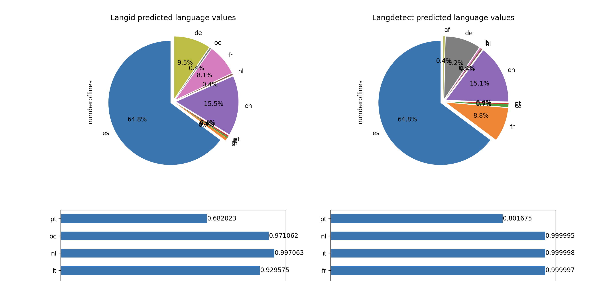

# Python-Language Detection Library Comparer

This is a project, written in Python, that compares the accuracy between two of the most used Python packages for language detection: [Langdetect](https://github.com/Mimino666/langdetect) and [Langid](https://github.com/saffsd/langid.py). 

A simple *txt* file is introduced as input and the program runs through each line of set file and predicts the language in which the line is written. These languages (and their probabilities) are then returned in a new **csv*** file called *lang_detection_results.csv*.

The program also outputs the prediction perfomance of each algorythm in various charts.

**NOTE**: This is strictly a prediction accuracy comparison, **NOT** a technical performance one. This means that there is no comparison on overall speed or memory or similar usage that each algorythm offers.

## Prerequisites

- *Python* installed. The version used for this project is *Python 3.11.2*
- **make** installed (for more information click [here](https://stackoverflow.com/questions/32127524/how-to-install-and-use-make-in-windows))
- _Recomended but not mandatory_ VS Code or a similiar IDE 

## How to install and Run the project

- First you will have to clone the project from this github repository

```bash
git clone https://github.com/syordanov94/language_detection.git
```

- Once cloned, you will need to download and update all module dependencies. To do this just use the *make* file provided by running the following command:

```bash
make
```

- Once upgraded, you can run the _language_detection.py_ file that performs all the functionality.

```bash
python3 language_detection.py
```

- Once ran, this will produce an output like the following:




## How to test the project